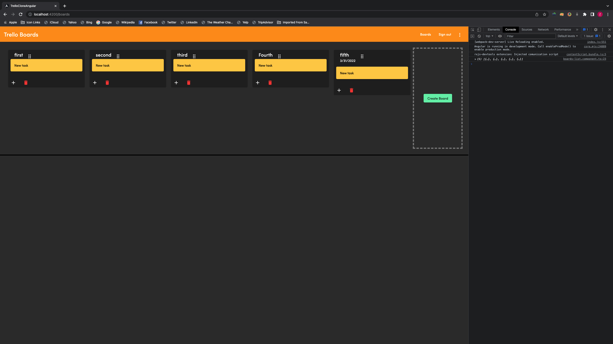
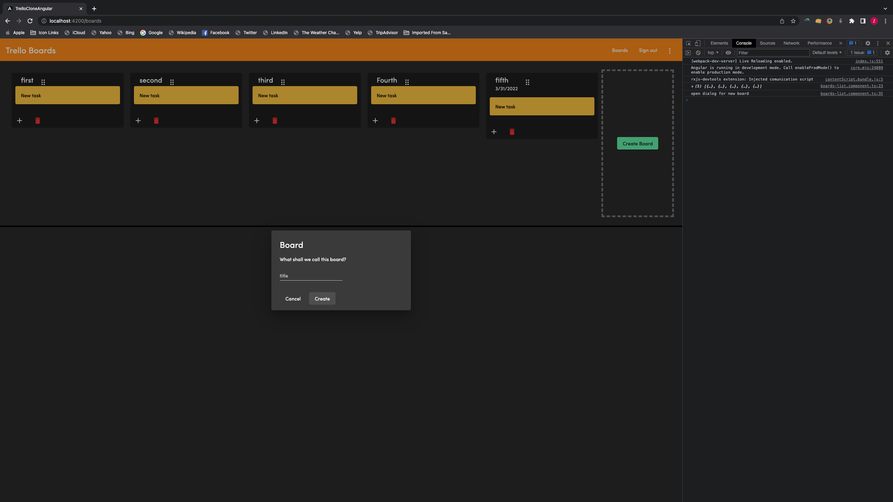
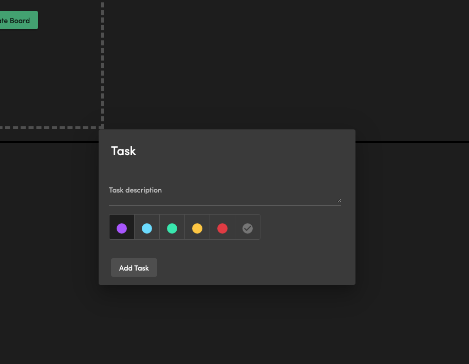
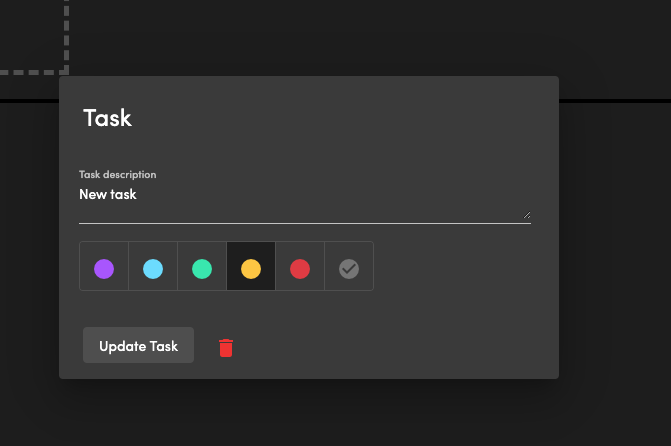
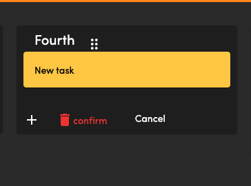
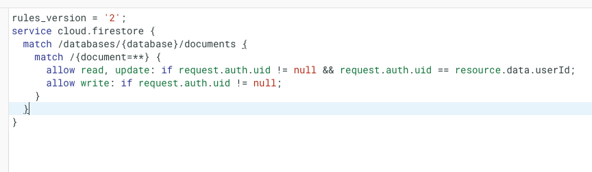

# TrelloCloneAngular

This project was generated with [Angular CLI](https://github.com/angular/angular-cli) version 13.2.4.

# Installation Instructions

Run $npm install in project directory to install the dependencies.

## Development server

Run `ng serve` for a dev server. Navigate to `http://localhost:4200/`. The app will automatically reload if you change any of the source files.

# Project Overview

This project will be a trello clone app using the fireship.io Angular course as a starting inspiration. However, i will be adding two branches to this repo, and one will be with a Firebase service singleton for persistent data storage and other branch will incorporate the state management using NGXS state, actions and selectors for the user boards, user auth state and individual tasks inside a board as well.
This project also applies the angular CDK for drag and drag.

## Draggable Individual boards

## Add New Board

## Add new Task

## Update Task

## Delete Reusable component with confirmation logic

## Firestore Security Rules

Only auth user can read his own boards & only auth users can create new boards and their userId is placed on every board they create

